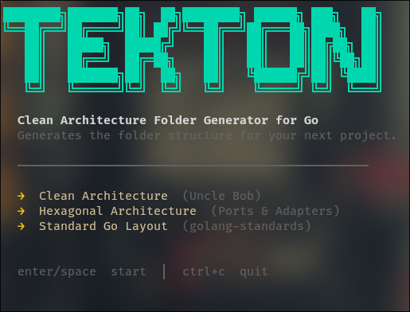

# Tekton

An interactive CLI tool that scaffolds Go project folder structures based on well-known architecture patterns.



---

## What it does

Tekton walks you through a short interactive prompt and generates a ready-to-use folder structure for your Go project. No config files, no YAML — just answer a few questions and start coding.

Supported architectures:

- **Clean Architecture** (Uncle Bob) — separation by business rule, framework-independent
- **Hexagonal Architecture** (Ports & Adapters) — domain at the center, ports define contracts
- **Standard Go Layout** (golang-standards) — conventional community layout for larger projects

---

## Installation

```bash
go install github.com/devguilhermeribeiiro/tekton@latest
```

---

## Usage

```bash
tekton <output-path>
```

**Example:**

```bash
tekton ~/projects
```

This will launch the interactive TUI. Use the keyboard to navigate:

| Key | Action |
|---|---|
| `Enter` / `Space` | Confirm / advance |
| `↑` / `k` | Move up |
| `↓` / `j` | Move down |
| `Esc` | Go back |
| `Ctrl+C` | Quit |

At the end, Tekton creates the folder structure under `<output-path>/<project-name>/` and shows you the next steps to get started.

---

## Example output

Running `tekton ~/projects` with the project name `my-api` and Clean Architecture selected generates:

```
my-api/
├── domain/         # Pure entities and business rules. Zero external dependencies.
├── usecase/        # Application use cases. Orchestrates the entities.
├── repository/     # Data access interfaces (contracts, not implementations).
├── infra/
│   ├── database/   # Concrete database implementations.
│   └── http/       # HTTP handlers, middleware, routers.
├── config/         # Application configuration (env, flags).
└── cmd/            # Application entry point.
```

After generation, Tekton prints the next steps:

```bash
cd ~/projects/my-api
go mod init github.com/your-username/my-api
```

---

## Dependencies

- [Bubble Tea](https://github.com/charmbracelet/bubbletea) — TUI framework
- [Lip Gloss](https://github.com/charmbracelet/lipgloss) — terminal styling

---

## License

MIT
